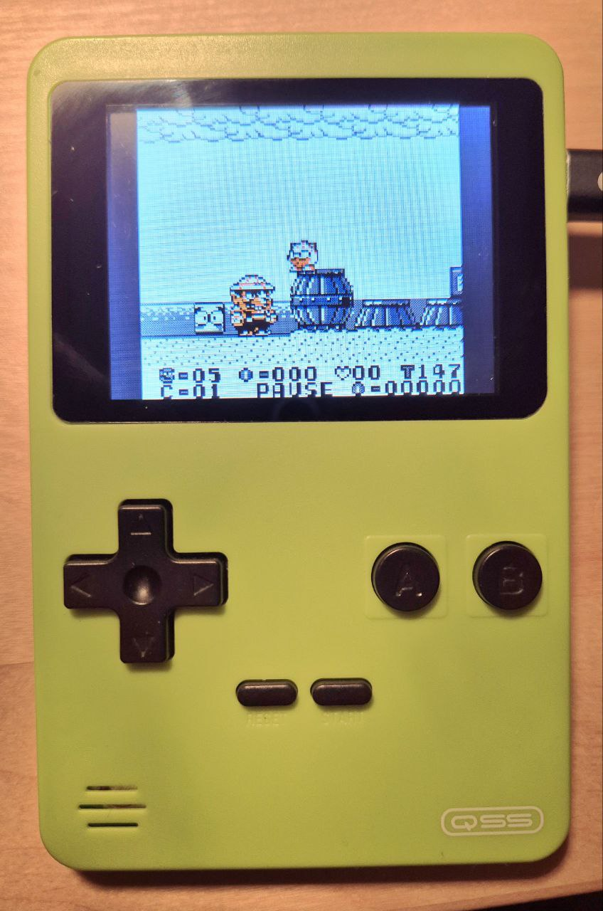
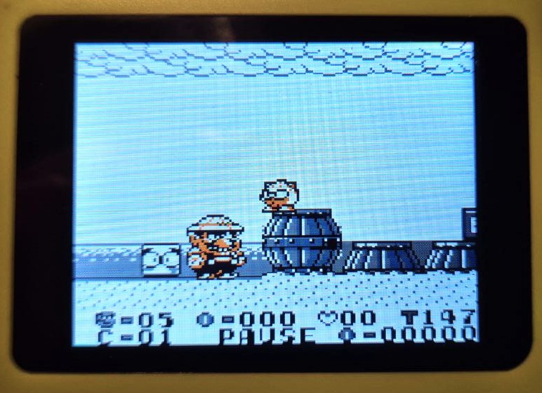
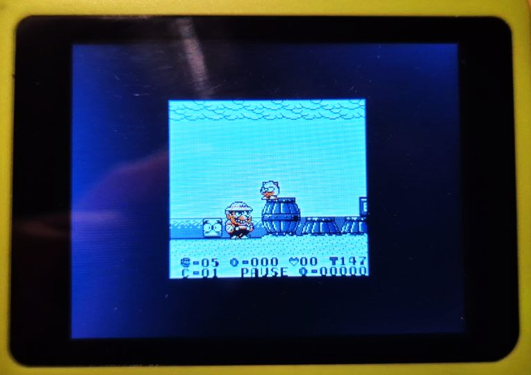
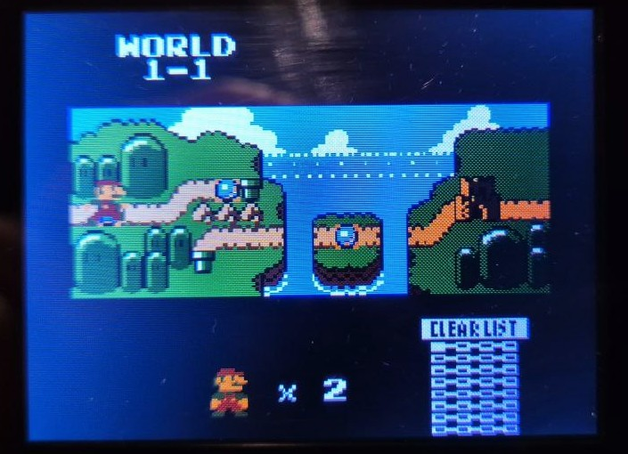

# RP2040-GB for Pico-GB

This is a fork of [YouMakeTech's Pico-GB Game Boy emulator](https://github.com/YouMakeTech/Pico-GB) which again is a fork of the [Peanut-GB based RP2040-GB Game Boy (DMG) emulator from deltabeard](https://github.com/deltabeard/Peanut-GB).
In addition to YouMakeTech and Deltabeards amazing work, this fork adds some improvements to the emulator like
* support for a larger variety of displays by using [Bodmer TFT_eSPI library](https://github.com/Bodmer/TFT_eSPI)
* scaling modes that can be toggled with `Select` + `B`. Note that no integer scaling is possible on this low resolution screens. The modes are:
  * full height with stretching to screen's width. Some columns/lines are doubled in this mode
  * full height with width scaled to original aspect ratio. Some columns/lines are doubled in this mode
  * original size (160x144 px, no scaling/stretching)
    

      

        

        Scaled with correct aspect ratio
      

      

        

        Stretched
      

      

        

        Original size (160x144 px, no scaling/stretching)
      

    

* gamma correction (value hard-coded but changeable in source-code) for color correction of the used display
* support for Game Boy Color games, thanks to (froggestspirit's CGB branch of Peanut-GB)[https://github.com/deltabeard/Peanut-GB/tree/cgb] that unfortunately is not merged yet to Peanut-GB main branch
    

      

    

* migration to [PlatformIO](https://platformio.org/) for easier development and integration of third-party libraries
* support for I2C IO expanders in case you want to use a fast 16-bit LCD display

It also includes the changes done by [YouMakeTech](https://github.com/YouMakeTech/Pico-GB):
* push buttons support
* overclocking to 266MHz for more accurate framerate (~60 FPS)
* I2S sound support (44.1kHz 16 bits stereo audio)
* SD card support (store roms and save games) + game selection menu
* automatic color palette selection for some games (emulation of Game Boy Color Bootstrap ROM) + manual color palette selection

# Videos by YouMakeTech
* [Let's build a Game Boy Emulator on a Breadboard!](https://youtu.be/ThmwXpIsGWs)
* [Build the ULTIMATE GameBoy Emulator for Raspberry Pi Pico](https://youtu.be/yauNQSS6nC4)

# Hardware
## What you need
* (1x) Raspberry Pi Pico 2
  * Note: a Pico 1 should also work as long as you do not want to use GB Color games. As the price difference is so small, I would not recommend to use a Pico 1 for this project
* (1x) An LCD screen, e.g. an 2.8" 320x240 ILI9341-based LCD Display Module works nicely.
  * Note that SPI displays might be too slow at this size. You might be better off with an 8-bit or 16-bit parallel display, where 8-bit might be the perfect tradeoff between speed and number of pins used.
  * At least you will not be able to use a 16-bit parallel display without an I2C IO expander, e.g. PCF8574.
  * smaller LCDs like the 176x220 one used in YouMakeTech's original project also work, but I did not implement any scaling for it
  * larger ones like 480x320 screens should also work. They might be interesting as they allow integer scaling (2x native resolution: 320x288 pixels). No scaling mode was implemented for this so far.
    * Do yourself a favor and do not use one with an SPI controller as the framerate might be really low. I tried a 3.5" SPI one that was designed for the Raspberry Pi and only got 20 FSP out of it.
    * 8-bit or 16-bit parallel should be fine and should easily give 60fps (probably 100 FPS without audio enabled).
* (1x) SD card reader, like [this one](https://www.androegg.de/shop/esp8266-stm-32-arduino-spi-kartenleser-33v/) - if the LCD board does not already have one built in
* (1x) FAT 32 formatted Micro SD card with roms you legally own. Roms must have the .gb or .gbc extension and must be copied to the root folder.
* (1x) MAX98357A amplifier
* (1x) 2W 8ohms speaker
* (8x) Micro Push Button Switch, Momentary Tactile Tact Touch, 6x6x6 mm, 4 pins
  * (optional - 1x) I2C IO expander (PCF8574) for the buttons if you use a 16-bit parallel LCD
* (1x) PCB or Breadboard
* Dupont Wires Assorted Kit (Male to Female + Male to Male + Female to Female)
* Preformed Breadboard Jumper Wires

Last but not least: you might want a shell.
* You might like the one from YouMakeTech: [Pico-GB 3d-printed Game Boy emulator handheld gaming console for Raspberry Pi Pico](https://www.youmaketech.com/pico-gb-gameboy-emulator-handheld-for-raspberry-pi-pico/) that ressembles to the original Nintendo Game Boy released in 1989.
  * See [Pico-GB assembly instructions, circuit diagrams, 3d printed files etc.](https://www.youmaketech.com/pico-gb-gameboy-emulator-handheld-for-raspberry-pi-pico/)
* Or just build your own like I did (I just modified a cheap retro arcade with "homebrew" games)

# Pinout
You must select your pinout via the tft-espi-config/tft_setup.h (for the display) and common.h (audio, input, sd-card) files.
For my 16-bit display with IO expander I use the following pins:

* I2C IO Expander (PCF8574)
  * SDA = 20
  * SCL = 21
  * UP / DOWN / LEFT / RIGHT / BUTTON A + B / SELECT / START = I2C IO Expander pins 0-7
* SD:
  * CS = GP17
  * CSK = GP18 (shared with LCD WR)
  * MOSI = GP19 (shared with LCD DC/RS)
  * MISO = GP16
* LCD (16-bit parallel)
  * D0-D15 = GP0 - GP15
  * CS = GP22
  * DC/RS = GP19 (shared with SD MOSI)
  * WR = GP18 (shared with SD CSK)
  * RST = not connected, pull high to 3.3V instead
  * LED = not connected, connect to 3.3V instead (could be connected to GP25 for PWM, but not implemented yet)
* I2S Audio (MAX98357A)
  * DIN = GP26
  * BCLK = GP27
  * LRC = GP28

As there is no pin left, reading the Display for VSYNC is not possible, so screen tearing might occur.
An 8-bit parallel LCD might be better suited for this project.
Maybe with 16-bit, the read pin can be shared with SD MISO(?) but at the moment no VSYNC support is enabled so far. The tearing is only visible slightly when the screen scrolls to the left or right.

# Flashing the firmware
As the project has to be configured to the display you want to use, there is no precompiled binary or UF2. You have to config the project first and then build and flash the firmware on your own with PlatformIO. See the next section.

# Building from source
PlatformIO is required to build this project. It can be installed as an extension to Visual Studio Code.
When PlatformIO is installed, just open the project in Visual Studio Code. It should be detected as a PlatformIO project. Now select the "pico2" environment. Then build and flash it.

# Preparing the SD card
The SD card is used to store game roms and save game progress. For this project, you will need a FAT 32 formatted Micro SD card with roms you legally own. Roms must have the .gb extension.

* Insert your SD card in a Windows computer and format it as FAT 32
* Copy your .gb and/or .gbc files to the SD card root folder (subfolders are not supported at this time)
* Insert the SD card into the SD card slot

# Known issues and limitations
* No copyrighted games are included with Pico-GB / RP2040-GB. For this project, you will need a FAT 32 formatted Micro SD card with roms you legally own. Roms must have the .gb extension.
* The RP2040-GB emulator is able to run at full speed on the Pico, at the expense of emulation accuracy. Some games may not work as expected or may not work at all. RP2040-GB is still experimental and not all features are guaranteed to work.
* RP2040-GB is only compatible with [original Game Boy DMG games](https://en.wikipedia.org/wiki/List_of_Game_Boy_games) (not compatible with Game Boy Color or Game Boy Advance games)
* Repeatedly flashing your Pico will eventually wear out the flash memory (Pico is qualified for min. 100K flash/erase cycles)
* The emulator overclocks the Pico in order to get the emulator working fast enough. Overclocking can reduce the Pico’s lifespan.
* Use this software and instructions at your own risk! I will not be responsible in any way for any damage to your Pico and/or connected peripherals caused by using this software. I also do not take responsibility in any way when damage is caused to the Pico or display due to incorrect wiring or voltages.

# License
MIT
